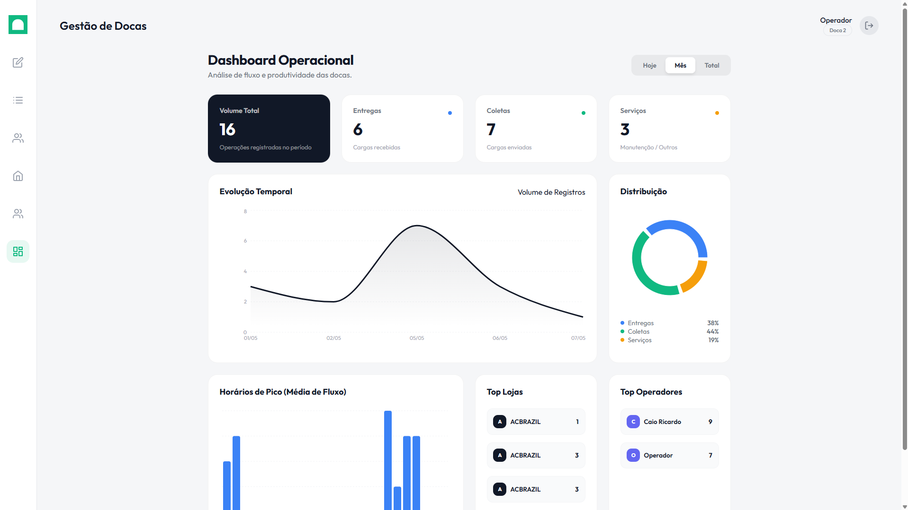
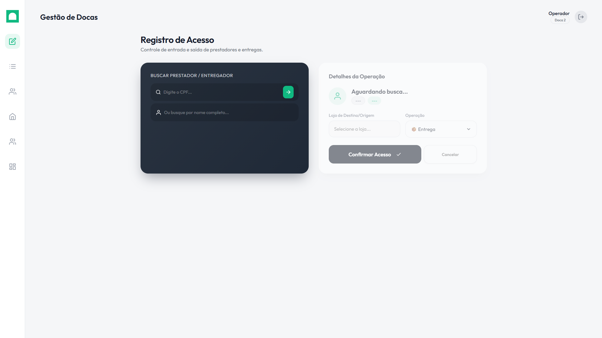
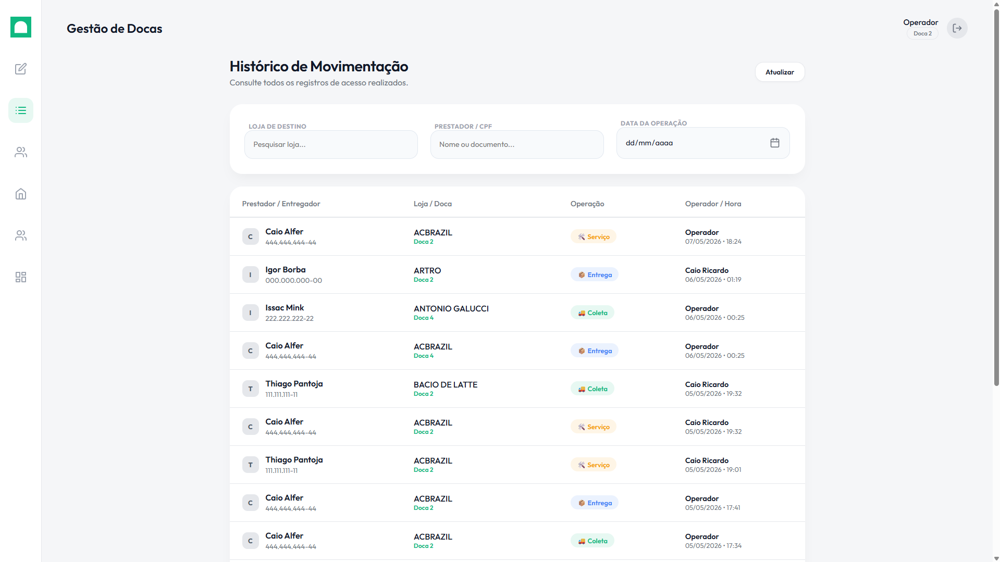
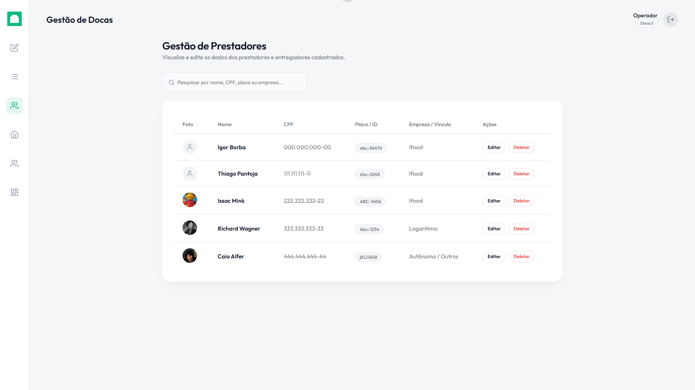
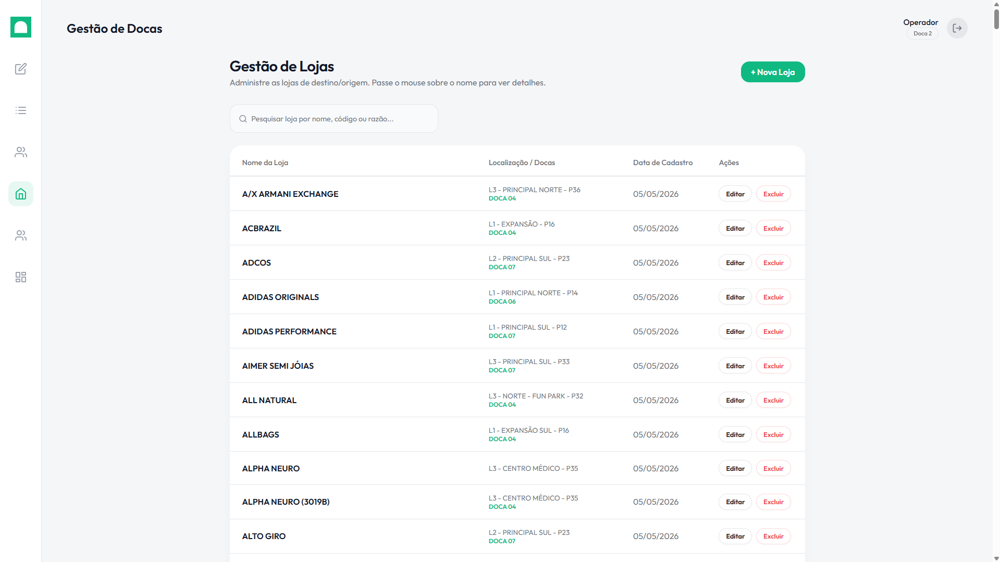
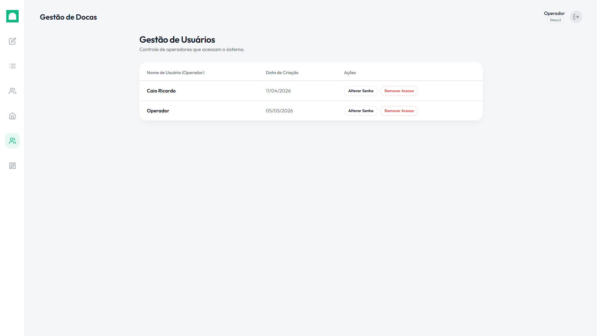

# GateManager

A modern, robust, and highly optimized system for gate management, access control, and dock logistics. Built with a strong focus on usability, security, and a premium design experience.

## About the Project

I developed this project individually, serving a dual purpose: as an intensive study project to improve my Full Stack skills, and as a real-world solution for the security and logistics department at the shopping mall where I work.

The main goal was to replace an outdated, poorly optimized legacy system that suffered from a bad user experience and numerous bugs. GateManager was built from the ground up to solve these pain points, offering a fast, reliable, and visually pleasing tool for the dock operators.

> Note on Language: While this README is in English to reach a broader developer community, the system's user interface is entirely in Portuguese. This is because it was custom-tailored for the local security and operations team in Brazil, ensuring zero friction in their daily workflow.

## Scalability and Adaptability

Although originally designed for a shopping mall's loading dock (managing deliveries, pickups, and maintenance services), GateManager is highly scalable. Its core architecture for access control, user management, and auditing can easily be adapted for:

- Corporate building access control
- Warehouse and distribution center logistics
- Residential concierge systems
- Event credential management

## Features

- Analytical Dashboard: Real-time charts showing hourly flow, operation distribution, and peak hours to help with staff scheduling.
- Access Control: Streamlined registration for entries and exits (Deliveries, Pickups, Services).
- Service Provider Management: Driver/provider registration with webcam photo capture or file upload.
- Complete History & Audit Trail: Advanced filtering by store, provider, and date.
- Store/Destination Management: Quick setup and control of destination stores.
- Operator Permissions: Segregated views where operators only see their own history, while administrators see global data.

## Default Access and Security

GateManager requires authentication to access the dashboard and operation tools.

When the database is first initialized, the system automatically creates a default user account. You can use this account to log in and start using or testing the system immediately.

**Default Login:**

- **User:** `Operador`
- **Password:** `123456`

Once logged in, you can create new operators, change passwords, and manage permissions in the "Usuários" (Users) tab. All passwords are securely hashed using Bcrypt before being stored in the database.

## Screenshots

### Dashboard



### Access Registration



### History



### Provider Management



### Store Management



### User Management



## Technologies Used

- Frontend: React, TypeScript, Vite, Recharts (for dynamic charts), CSS (Glassmorphism UI).
- Backend: Node.js, Express.
- Database: SQLite (Perfect for local deployment and low-complexity infra).
- Security: Bcrypt for password hashing.

## Installation and Setup

### Prerequisites

- Node.js (v18+ recommended)
- npm or yarn

### Steps

1. Clone the repository:

   ```bash
   git clone https://github.com/YOUR_USERNAME/gatemanager.git
   cd gatemanager
   ```

2. Install backend dependencies (Root folder):

   ```bash
   npm install
   ```

3. Install frontend dependencies:

   ```bash
   cd frontend
   npm install
   cd ..
   ```

4. Run the entire project with a single command (starts both backend and frontend concurrently):

   ```bash
   npm run dev
   ```

5. The application will be available at: `http://localhost:5173`

## 🔒 Security Considerations & Roadmap

As this system was initially designed for a local, trusted intranet environment (a shopping mall's internal network), some advanced web security features were deferred. If you intend to deploy GateManager to a public-facing server, the following security implementations are on the roadmap and highly recommended:

- **Authentication Tokens (JWT):** Currently, the system relies on client-side state for session management. Implementing JSON Web Tokens (JWT) for secure, stateless API route protection is the next priority step.
- **HTTPS/SSL:** The application runs on HTTP by default. For production deployment over the internet, a reverse proxy (like Nginx) with an SSL certificate must be configured to encrypt sensitive data (Passwords, CPFs).
- **Rate Limiting:** Implementing brute-force protection (e.g., `express-rate-limit`) on the login and registration endpoints.
- **Strict CORS Policy:** The current CORS policy is permissive for easy local development. It should be restricted to specific allowed origins in production.

## License

© 2026 Caio Alfer. All rights reserved.

This project is proprietary and confidential. Unauthorized copying, modification, distribution, or commercial use of this software, via any medium, is strictly prohibited. It was developed for portfolio and study purposes as a custom solution for a specific commercial infrastructure.
